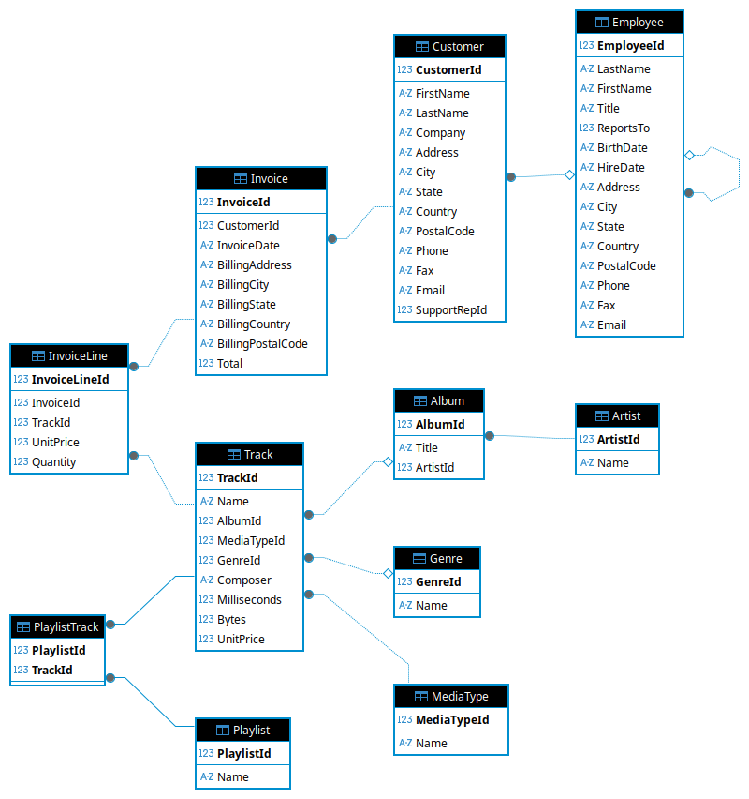
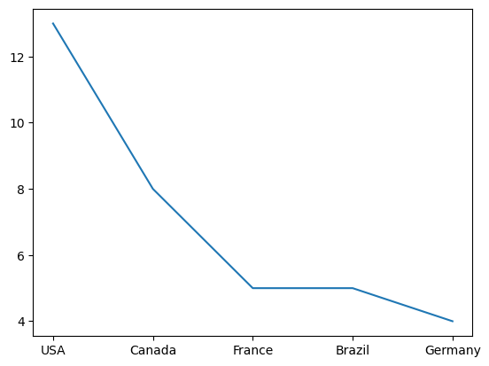

# Как работать с репозиторием
1. Создайте папку проекта, например `sqllessons`
2. Перейдите в созданную папку `sqllessons`
3. Выполните `git clone git@github.com:barmaley350/SQLLessons.git . `
4. Выполните `uv sync`
5. Внесите изменения в `jupyter_notebooks/examples.ipynb`
6. Выполните `uv run python3 main.py` чтобы зафиксировать изменения в `README.md`

# Основные категории SQL‑команд
Разберем основные категории SQL‑команд — с расшифровкой, назначением и примерами.


## 1. DDL (Data Definition Language) — язык определения данных

**Назначение:** управление структурой базы данных («скелет» БД): создание, изменение и удаление объектов.

**Ключевые команды:**
* `CREATE` — создание новых объектов (таблиц, индексов, представлений, схем);
* `ALTER` — изменение существующих объектов (добавление/удаление столбцов, изменение типов данных);
* `DROP` — удаление объектов (таблицы, индексы и т. д.);
* `TRUNCATE` — очистка всех данных из таблицы без удаления её структуры;
* `RENAME` — переименование объектов;
* `COMMENT` — добавление комментариев к объектам.


**Примеры:**
```sql
-- Создание таблицы
CREATE TABLE employees (
    id INT PRIMARY KEY,
    name VARCHAR(100)
);

-- Добавление столбца
ALTER TABLE employees ADD email VARCHAR(100);

-- Удаление таблицы
DROP TABLE employees;

-- Очистка данных таблицы
TRUNCATE TABLE employees;
```

**Особенности:**
* автоматически выполняют неявный `COMMIT` (изменения нельзя отменить);
* часто требуют повышенных привилегий;
* при `DROP` данные теряются безвозвратно.


---

## 2. DML (Data Manipulation Language) — язык манипулирования данными

**Назначение:** работа с содержимым таблиц: добавление, изменение, удаление и извлечение данных.


**Ключевые команды:**
* `SELECT` — извлечение данных из таблиц;
* `INSERT` — добавление новых записей;
* `UPDATE` — изменение существующих записей;
* `DELETE` — удаление записей по условию;
* `MERGE` — комбинированная операция вставки/обновления (есть не во всех СУБД).

**Примеры:**
```sql
-- Извлечение данных
SELECT * FROM employees WHERE department = 'IT';

-- Добавление записи
INSERT INTO employees (id, name) VALUES (1, 'Анна Иванова');

-- Обновление данных
UPDATE employees SET salary = 50000 WHERE id = 1;

-- Удаление записей
DELETE FROM employees WHERE status = 'уволен';
```

**Особенности:**
* операции можно отменить через `ROLLBACK` до `COMMIT`;
* `SELECT` не изменяет данные;
* `INSERT`, `UPDATE`, `DELETE` могут запускать триггеры.

---

## 3. DQL (Data Query Language) — язык запросов

**Назначение:** только чтение данных (часто считают частью DML, но выделяют отдельно из‑за специфики).

**Ключевая команда:**
* `SELECT` — выборка данных с фильтрацией, сортировкой, группировкой.

**Пример:**
```sql
SELECT name, department
FROM employees
WHERE salary > 40000
ORDER BY name;
```

---

## 4. DCL (Data Control Language) — язык управления доступом

**Назначение:** контроль прав пользователей и ролей для обеспечения безопасности данных.

**Ключевые команды:**
* `GRANT` — предоставление прав доступа;
* `REVOKE` — отзыв ранее предоставленных прав;
* `DENY` — явный запрет действий (в некоторых СУБД, например, Microsoft SQL Server).

**Примеры:**
```sql
-- Предоставление прав
GRANT SELECT, INSERT ON employees TO hr_manager;

-- Отзыв прав
REVOKE DELETE ON employees FROM junior_developer;
```

---

## 5. TCL (Transaction Control Language) — язык управления транзакциями

**Назначение:** обеспечение целостности данных при выполнении группы операций («всё или ничего»).

**Ключевые команды:**
* `COMMIT` — фиксация изменений (делает их постоянными);
* `ROLLBACK` — отмена изменений до последней точки сохранения;
* `SAVEPOINT` — установка промежуточной точки сохранения внутри транзакции;
* `BEGIN` / `START TRANSACTION` — начало транзакции.

**Пример:**
```sql
BEGIN TRANSACTION;
UPDATE accounts SET balance = balance - 1000 WHERE user_id = 1;
UPDATE accounts SET balance = balance + 1000 WHERE user_id = 2;
COMMIT; -- или ROLLBACK при ошибке
```

---

## Краткий итог: сравнение категорий


| Категория | Назначение | Основные команды | Изменяет данные? | Можно отменить? |
|---------|-----------|---------------|----------------|---------------|
| **DDL** | Структура БД | `CREATE`, `ALTER`, `DROP`, `TRUNCATE` | Нет (только структуру) | Нет |
| **DML** | Содержимое таблиц | `INSERT`, `UPDATE`, `DELETE`, `MERGE` | Да | Да (до `COMMIT`) |
| **DQL** | Чтение данных | `SELECT` | Нет | — |
| **DCL** | Права доступа | `GRANT`, `REVOKE`, `DENY` | Нет (метаданные) | Да |
| **TCL** | Целостность операций | `COMMIT`, `ROLLBACK`, `SAVEPOINT` | Да (группой) | Да (`ROLLBACK`) |

Понимание этих категорий помогает:
* структурировать код;
* выбирать правильные команды для задач;
* обеспечивать безопасность и целостность данных;
* готовиться к собеседованиям и сертификациям.

# Порядок выполнения SQL‑запроса (логический)


Важно различать **порядок написания** SQL‑запроса и **порядок его выполнения** — они не совпадают. Разберу пошагово логический порядок обработки команд.

## Порядок выполнения


1. **`FROM` / `JOIN`**
   * Определяются источники данных: таблицы и соединения (`JOIN`).
   * Формируется базовый набор строк для дальнейшей обработки.


2. **`WHERE`**
   * Фильтрация строк: отбрасываются записи, не удовлетворяющие условиям.
   * Обработка происходит **до группировки**.


3. **`GROUP BY`**
   * Данные группируются по указанным столбцам.
   * Каждая группа содержит строки с одинаковыми значениями в указанных столбцах.

4. **Агрегирующие функции** (`SUM`, `COUNT`, `AVG` и т. д.)
   * Вычисляются над данными в группах.
   * Например, `COUNT(*)` считает количество строк в каждой группе.

5. **`HAVING`**
   * Фильтруются группы, не соответствующие условиям.
   * В отличие от `WHERE`, работает с **результатами агрегации**.

   * Пример: `HAVING COUNT(*) > 5` оставит только группы с более чем 5 строками.

6. **Оконные функции**
   * Выполняются вычисления по «окнам» строк (определённым `PARTITION BY` и `ORDER BY`).
   * Примеры: `ROW_NUMBER()`, `LAG()`, `SUM() OVER()`.

7. **`SELECT`**
   * Выбираются столбцы и выражения для итогового результата.
   * Создаются алиасы (псевдонимы) через `AS`.
   * На этом этапе становятся доступны для использования результаты оконных функций.

8. **`DISTINCT`**
   * Удаляются дублирующиеся строки из результата.
   * Применяется после выбора столбцов.

9. **`UNION` / `INTERSECT` / `EXCEPT`**
   * Объединяются результаты нескольких запросов.
   * `UNION` — объединение, `INTERSECT` — пересечение, `EXCEPT` — разность.

10. **`ORDER BY`**
    * Сортировка строк по указанным столбцам или выражениям.
    * Можно использовать алиасы из `SELECT`.
    * По умолчанию — по возрастанию (`ASC`), для убывания — `DESC`.

11. **`OFFSET`**
    * Пропускаются указанное количество строк.
    * Часто используется для постраничной навигации.
    * Пример: `OFFSET 10` пропустит первые 10 строк.

12. **`LIMIT` / `FETCH` / `TOP`**
    * Ограничивается количество возвращаемых строк.
    * `LIMIT 5` вернёт не более 5 строк.
    * Выполняется **в самом конце**, после всех остальных операций.

---

## Важные нюансы

* **Оптимизатор СУБД** может менять реальный порядок выполнения для повышения эффективности, но **логический порядок** остаётся таким, как описано выше.
* Нельзя использовать алиас из `SELECT` в `WHERE` или `GROUP BY` — на момент их выполнения `SELECT` ещё не выполнен.
* Оконные функции вычисляются **после** агрегации и `HAVING`, поэтому их нельзя использовать в `WHERE`.
* Для обхода ограничений можно использовать **CTE** (`WITH`) или подзапросы: сначала вычислить нужные значения, затем фильтровать по ним.

---

## Пример

Запрос:
```sql
SELECT name, SUM(amount) AS total
FROM orders
JOIN customers ON orders.customer_id = customers.id
WHERE order_date >= '2023-01-01'
GROUP BY name
HAVING SUM(amount) > 1000
ORDER BY total DESC
LIMIT 10;
```

Порядок выполнения:
1. Соединяем таблицы `orders` и `customers` (`FROM` + `JOIN`).
2. Оставляем только заказы с 2023 года (`WHERE`).
3. Группируем по имени клиента (`GROUP BY`).
4. Считаем сумму заказов для каждого клиента (`SUM(amount)`).
5. Отбрасываем клиентов с суммой меньше 1000 (`HAVING`).
6. Выбираем столбцы `name` и `total` (`SELECT`).
7. Сортируем по убыванию суммы (`ORDER BY`).
8. Оставляем топ‑10 клиентов (`LIMIT`).

# О базе данных **Chinook**
**База данных примеров Chinook** — это общедоступная база данных с открытым исходным кодом, созданная разработчиком Microsoft Линном Рутом.

Она широко используется в обучающих материалах и курсах.

В каждой таблице базы данных хранится достоверная информация о продажах музыки:
- **album** — названия альбомов и исполнители
- **artist** — информация об исполнителях
- **track** — отдельные музыкальные треки с указанием альбома, жанра и типа носителя
- **genre** — список доступных музыкальных жанров
- **customer** — контактные данные и местоположение клиентов
- **invoice** — счета клиентов
- **invoice_item** — позиции, включенные в каждый счет
- **playlist** — плейлисты, созданные пользователями
- **playlist_track** — сопоставление плейлистов и треков
- **employee** — данные о сотрудниках и представителях службы поддержки 

# Схема базы данных **Chinook**


# Примеры запросов при работе с базой данных **Chinook**

##  Подключаем необходимые модули


```python
import sqlite3
from pathlib import Path

import matplotlib.pyplot as plt
import pandas as pd

```


```python
db_path = Path(Path.cwd().parent) / "db/chinook.db"
conn = sqlite3.connect(db_path)
```

##  Выбрать все записи из таблицы `customer`
Запрос `SELECT * FROM customer LIMIT 5;` извлекает все столбцы из таблицы `customer` и возвращает первые 5 строк данных — остальные записи игнорируются.


```python
sql = "SELECT * FROM customer LIMIT 5;"
data = pd.read_sql_query(sql, conn)
data
```


<div>

<table border="1" class="dataframe">
  <thead>
    <tr style="text-align: right;">
      <th></th>
      <th>CustomerId</th>
      <th>FirstName</th>
      <th>LastName</th>
      <th>Company</th>
      <th>Address</th>
      <th>City</th>
      <th>State</th>
      <th>Country</th>
      <th>PostalCode</th>
      <th>Phone</th>
      <th>Fax</th>
      <th>Email</th>
      <th>SupportRepId</th>
    </tr>
  </thead>
  <tbody>
    <tr>
      <th>0</th>
      <td>1</td>
      <td>Luís</td>
      <td>Gonçalves</td>
      <td>Embraer - Empresa Brasileira de Aeronáutica S.A.</td>
      <td>Av. Brigadeiro Faria Lima, 2170</td>
      <td>São José dos Campos</td>
      <td>SP</td>
      <td>Brazil</td>
      <td>12227-000</td>
      <td>+55 (12) 3923-5555</td>
      <td>+55 (12) 3923-5566</td>
      <td>luisg@embraer.com.br</td>
      <td>3</td>
    </tr>
    <tr>
      <th>1</th>
      <td>2</td>
      <td>Leonie</td>
      <td>Köhler</td>
      <td>NaN</td>
      <td>Theodor-Heuss-Straße 34</td>
      <td>Stuttgart</td>
      <td>NaN</td>
      <td>Germany</td>
      <td>70174</td>
      <td>+49 0711 2842222</td>
      <td>NaN</td>
      <td>leonekohler@surfeu.de</td>
      <td>5</td>
    </tr>
    <tr>
      <th>2</th>
      <td>3</td>
      <td>François</td>
      <td>Tremblay</td>
      <td>NaN</td>
      <td>1498 rue Bélanger</td>
      <td>Montréal</td>
      <td>QC</td>
      <td>Canada</td>
      <td>H2G 1A7</td>
      <td>+1 (514) 721-4711</td>
      <td>NaN</td>
      <td>ftremblay@gmail.com</td>
      <td>3</td>
    </tr>
    <tr>
      <th>3</th>
      <td>4</td>
      <td>Bjørn</td>
      <td>Hansen</td>
      <td>NaN</td>
      <td>Ullevålsveien 14</td>
      <td>Oslo</td>
      <td>NaN</td>
      <td>Norway</td>
      <td>0171</td>
      <td>+47 22 44 22 22</td>
      <td>NaN</td>
      <td>bjorn.hansen@yahoo.no</td>
      <td>4</td>
    </tr>
    <tr>
      <th>4</th>
      <td>5</td>
      <td>František</td>
      <td>Wichterlová</td>
      <td>JetBrains s.r.o.</td>
      <td>Klanova 9/506</td>
      <td>Prague</td>
      <td>NaN</td>
      <td>Czech Republic</td>
      <td>14700</td>
      <td>+420 2 4172 5555</td>
      <td>+420 2 4172 5555</td>
      <td>frantisekw@jetbrains.com</td>
      <td>4</td>
    </tr>
  </tbody>
</table>
</div>


##  Выбрать все записи из таблицы `customer` по определенным столбцам
Запрос `SELECT FirstName, LastName, Country FROM customer LIMIT 5;` извлекает из таблицы `customer` только три указанных столбца (`FirstName`, `LastName` и `Country`) и возвращает первые 5 строк данных — все остальные строки игнорируются благодаря ограничению `LIMIT 5`.


```python
sql = "SELECT FirstName, LastName, Country FROM customer LIMIT 5;"
data = pd.read_sql_query(sql, conn)
data
```


<div>

<table border="1" class="dataframe">
  <thead>
    <tr style="text-align: right;">
      <th></th>
      <th>FirstName</th>
      <th>LastName</th>
      <th>Country</th>
    </tr>
  </thead>
  <tbody>
    <tr>
      <th>0</th>
      <td>Luís</td>
      <td>Gonçalves</td>
      <td>Brazil</td>
    </tr>
    <tr>
      <th>1</th>
      <td>Leonie</td>
      <td>Köhler</td>
      <td>Germany</td>
    </tr>
    <tr>
      <th>2</th>
      <td>François</td>
      <td>Tremblay</td>
      <td>Canada</td>
    </tr>
    <tr>
      <th>3</th>
      <td>Bjørn</td>
      <td>Hansen</td>
      <td>Norway</td>
    </tr>
    <tr>
      <th>4</th>
      <td>František</td>
      <td>Wichterlová</td>
      <td>Czech Republic</td>
    </tr>
  </tbody>
</table>
</div>


##  Посчитать кол-во клиентов каждой стране
Запрос `SELECT Country, COUNT(*) AS customer_count FROM customer GROUP BY Country ORDER BY customer_count DESC;` группирует записи из таблицы `customer` по столбцу `Country`, подсчитывает количество клиентов в каждой стране (`COUNT(*)` и присваивает результату псевдоним `customer_count`), а затем сортирует полученные данные по убыванию числа клиентов — так, что страна с наибольшим количеством клиентов оказывается первой в итоговом списке.


```python
sql = """SELECT Country, Count(*) AS customer_count 
    FROM customer 
    GROUP BY Country 
    ORDER BY customer_count DESC;"""
data = pd.read_sql_query(sql, conn)
data.head(5)
```


<div>

<table border="1" class="dataframe">
  <thead>
    <tr style="text-align: right;">
      <th></th>
      <th>Country</th>
      <th>customer_count</th>
    </tr>
  </thead>
  <tbody>
    <tr>
      <th>0</th>
      <td>USA</td>
      <td>13</td>
    </tr>
    <tr>
      <th>1</th>
      <td>Canada</td>
      <td>8</td>
    </tr>
    <tr>
      <th>2</th>
      <td>France</td>
      <td>5</td>
    </tr>
    <tr>
      <th>3</th>
      <td>Brazil</td>
      <td>5</td>
    </tr>
    <tr>
      <th>4</th>
      <td>Germany</td>
      <td>4</td>
    </tr>
  </tbody>
</table>
</div>


```python
fig, (ax1, ax2) = plt.subplots(1, 2, figsize=(12, 5))
ax1.plot(data["Country"].head(5), data["customer_count"].head(5), label="Количество клиентов")
ax1.set_ylabel("Кол-во клиентов")
ax1.set_xlabel("Страны")
ax1.set_title("Top 5 стран по кол-ву клиентов")
ax1.legend()
ax1.grid(True, alpha=0.3)

ax2.plot(data["Country"].tail(5), data["customer_count"].tail(5), label="Количество клиентов")
ax2.set_ylabel("Кол-во клиентов")
ax2.set_xlabel("Страны")
ax2.set_title("Top 5 стран по кол-ву клиентов")
ax2.legend()
ax2.grid(True, alpha=0.3)

plt.show()
```


    

    

